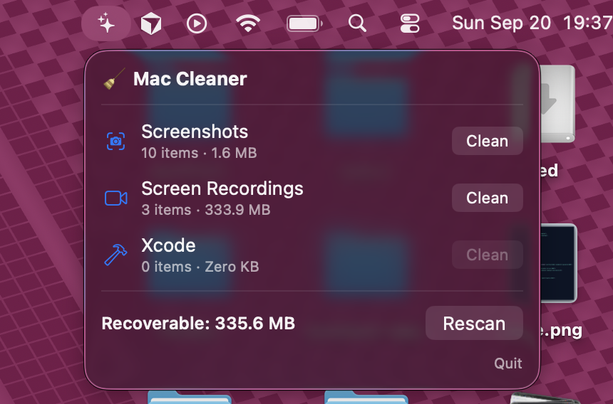
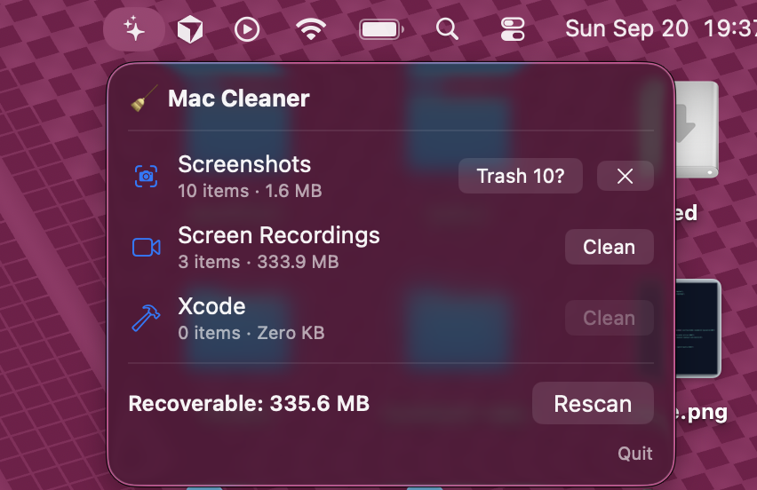

# Mac Cleaner

A small menu-bar app for macOS that finds the files quietly eating your disk — old
screenshots, screen recordings and Xcode build leftovers — and moves them to the Trash.

It is deliberately boring: it never deletes anything, it never phones home, and it only
looks in a handful of folders you already know about.

| One click to see what's recoverable | A second click to confirm |
| --- | --- |
|  |  |

It lives in the menu bar: no Dock icon, no window, no launch screen. Click the ✨, read
three numbers, decide.

## The problem

Disk space on a Mac disappears in a very specific way, and it is almost never the files
you think about:

- **Screenshots.** Every `⌘⇧4` drops a PNG on the Desktop. You take one to paste into a
  chat, and it stays there forever. A year of those is hundreds of files.
- **Screen recordings.** Same habit, but each file is measured in hundreds of megabytes
  instead of hundreds of kilobytes.
- **Xcode.** `~/Library/Developer/Xcode/DerivedData` holds a build cache per project and
  never cleans up after projects you stopped working on. Old `.xcarchive` bundles sit in
  `Archives` forever. On a working machine this is routinely tens of gigabytes.

macOS's own "Storage" pane will tell you that "Documents" is large. It won't tell you
that 22 GB of it is build output for an app you shipped two years ago, and it won't
help you act on it.

The other option is a commercial cleaner, and those tend to be the opposite of boring:
subscriptions, "junk" categories nobody can define, and a lot of enthusiasm about
deleting files on your behalf.

Mac Cleaner is the small version. Three categories that are easy to reason about,
a number next to each one, and a button.

## How it works

Three pieces, layered so the risky part is tiny and isolated:

```
┌──────────────┐   ┌──────────────┐
│ MacCleanerApp│   │   cleaner    │   ← menu-bar app (SwiftUI) and CLI
│  (menu bar)  │   │    (CLI)     │
└──────┬───────┘   └──────┬───────┘
       └────────┬─────────┘
                ▼
        ┌───────────────┐
        │   CleanerKit  │              ← the brain: all the logic lives here
        │               │
        │  Scanners ──► ScanResult     scanners only ever *read*
        │  Cleaner  ──► Trash          one type, and only it, touches files
        └───────────────┘
```

### Scanners find things

A scanner is anything that can answer "what did you find?":

```swift
public protocol StorageScanner: Sendable {
    var name: String { get }
    func scan() throws -> ScanResult
}
```

A scanner never deletes. It returns a `ScanResult`: a list of `FileItem`s (URL, size,
creation date, last-opened date), already sorted largest-first, plus a list of folders
macOS refused to let it read.

Three scanners ship today:

| Scanner | Looks in | Finds |
| --- | --- | --- |
| `ScreenshotScanner` | screenshot save location + `~/Downloads` | image captures |
| `ScreenRecordingScanner` | the same folders | video captures |
| `XcodeScanner` | `~/Library/Developer/Xcode` | `DerivedData` folders, `Archives` |

**Finding screenshots** is more interesting than matching `Screenshot*.png`. macOS tags
every capture it makes with an extended attribute — a small named tag stored on the file
itself, which you can see with `xattr -l`:

```
com.apple.metadata:kMDItemIsScreenCapture
com.apple.metadata:kMDItemIsScreenRecording
```

The tag travels with the file, so a screenshot stays identifiable after you rename it.
Mac Cleaner reads these tags directly with `getxattr`, and falls back to filename
prefixes (`Screenshot`, `Screen Shot`, `Screen Recording`, `Simulator Screen`) for files
that lost their tag — for example a recording AirDropped from another Mac.

Screenshot vs. recording is then decided by `UniformTypeIdentifiers`, not by file
extension: anything whose type conforms to `.movie` is a recording.

Two deliberate limits keep this conservative:

- Only the **top level** of each folder is read. A capture you filed into a project
  subfolder is a file you meant to keep, so it is never offered.
- The save location is read from your actual preference
  (`defaults read com.apple.screencapture location`), not assumed to be the Desktop.

**Finding Xcode junk** is a directory walk: each child of `DerivedData` becomes one item,
sized by summing its contents; `Archives` nests one level deeper
(`Archives/<date>/<name>.xcarchive`) so it recurses once. All of it is regenerable —
Xcode rebuilds `DerivedData` on the next build.

### Age filtering

Every `FileItem` knows how long it has been untouched, preferring the last-opened date
(macOS keeps it in the `com.apple.lastuseddate#PS` attribute — the same value Finder shows
in its "Last opened" column) and falling back to the creation date.

```swift
result.filtered(untouchedForDays: 30)
```

Files whose dates are unknown are **dropped**, not kept, so a file of unknown age is
never suggested for deletion by accident.

### One type deletes

`Cleaner` is the only type in the whole project that writes to disk, and it has exactly
one move:

```swift
try fileManager.trashItem(at: item.url, resultingItemURL: nil)
```

Move to Trash — never `removeItem`. Every action is undoable from Finder, and the app
never needs to ask "are you sure?" in the scary sense. Failures are collected and
reported per file rather than aborting the run, so one locked file doesn't stop the rest.

### Permissions

Desktop, Documents and Downloads are privacy-protected on modern macOS, which caused the
one genuinely surprising design decision in the project.

Spotlight (`MDQuery`) looked like the obvious way to find screenshots — and it works, but
it **silently omits** files in protected folders from an app that hasn't been granted
access, and it never triggers the "allow access?" prompt. The app would show an empty
list with no way for the user to fix it.

Reading the folder directly with `FileManager` is what makes macOS ask. So that's what
the screen-capture scanners do. When permission is refused, the folder is reported in
`ScanResult.inaccessibleFolders`, and the UI shows a banner with a button that opens the
right System Settings pane — because once you've clicked "Don't Allow", macOS will not
ask a second time.

(`Spotlight.swift` remains as a synchronous `MDQuery` wrapper, useful for scanners over
unprotected locations, since it works without a run loop.)

### The interfaces

The **menu-bar app** is a `MenuBarExtra` with `LSUIElement` set, so it has no Dock icon
and no app menu — it lives in the status bar. `CleanerModel` is an `@Observable`
`@MainActor` class holding all the state; the disk walking runs in `Task.detached` so the
popover never freezes. Cleaning is two-step: **Clean** turns into **Trash 214?**, so no
single click ever moves files.

The **CLI** is the same brain with a text front end, and it's the quickest way to try the
project:

```
cleaner scan [--older-than N]
cleaner clean <screenshots|recordings|xcode> [--older-than N] [--yes]
```

```
🧹 Mac Cleaner — scanning…

📸 Screenshots
   214 items, 1.1 GB

🎥 Screen Recordings
   18 items, 4.3 GB

🛠 Xcode
   9 items, 22.7 GB

──────────────────
Recoverable: 28.1 GB
```

## Stack

- **Swift 6** with strict concurrency — `Sendable` value types across the board, so the
  compiler proves that scan results can cross threads safely.
- **SwiftUI** (`MenuBarExtra`, `@Observable`) for the menu-bar UI; macOS 14+.
- **Swift Package Manager** — no Xcode project file; `CleanerKit` is a plain library
  target, so the logic is testable without launching a UI.
- **Swift Testing** (`@Test`, `#expect`) for the tests.
- **Foundation / CoreServices / Darwin** — `FileManager` for walking and trashing,
  `getxattr` for capture tags, `MDQuery` for Spotlight, `UniformTypeIdentifiers` for
  file-type checks.
- **zsh + `codesign`** for packaging: `scripts/build-app.sh` assembles the `.app` bundle,
  writes the `Info.plist`, generates the icon, and ad-hoc signs it.

Zero third-party dependencies.

## Running it

Requires macOS 14 or later and a Swift 6 toolchain (Xcode 16+).

```sh
git clone https://github.com/okoliken/MacCleaner.git
cd MacCleaner

swift run cleaner scan              # see what's recoverable
swift test                          # run the tests

scripts/build-app.sh --install      # build MacCleaner.app and install it
```

After installing, launch **MacCleaner** from `/Applications`. It appears as a ✨ in the
menu bar — there's no Dock icon and no window. The first scan will prompt for access to
Desktop and Downloads; if you decline, the app shows a banner with a shortcut to the
right Settings pane.

The build script signs the app ad-hoc (`codesign --sign -`), which is enough to run it on
your own machine. To distribute it to anyone else, swap in a Developer ID identity and
notarize.

## Layout

```
Sources/
  CleanerKit/              the brain — no UI, no app framework
    Scanner.swift          the StorageScanner protocol
    FileItem.swift         FileItem, ScanResult, age filtering
    ScreenCaptureScanners.swift
    XcodeScanner.swift
    ExtendedAttributes.swift   getxattr wrapper
    Spotlight.swift        MDQuery wrapper
    Cleaner.swift          the only type that touches files
  MacCleanerApp/           SwiftUI menu-bar app
  cleaner/                 CLI
Tests/CleanerKitTests/
scripts/
  build-app.sh             .app bundle + Info.plist + icon + signing
  make-icon.swift          draws the app icon
docs/                      README screenshots
```

## Where it's going

- Launch at login, and a nicer popover.
- More scanners — the protocol is the whole extension point: return a `ScanResult` and
  the CLI and app both pick it up. Obvious candidates: iOS Simulator device images,
  npm/Homebrew caches, old `.dmg` files in Downloads.
- An age slider in the UI, wired to the `filtered(untouchedForDays:)` that already exists.

## Licence

MIT — see [LICENSE](LICENSE).
